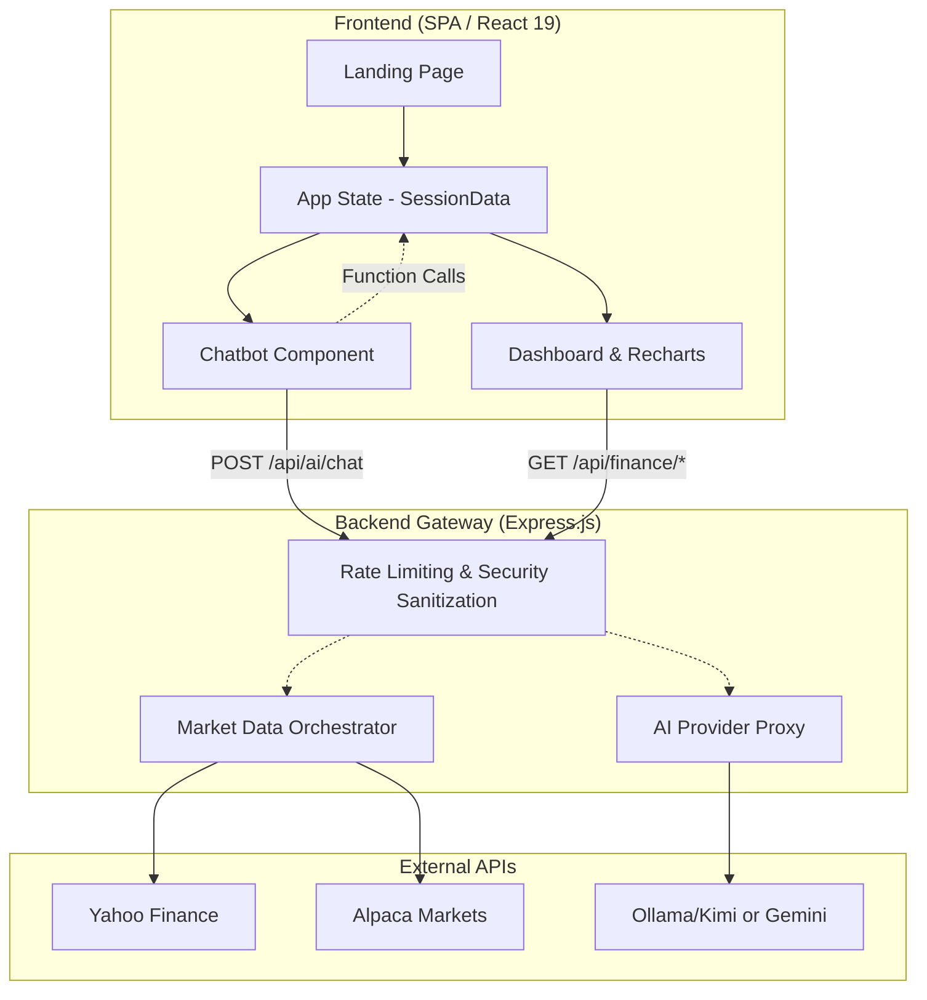

<div align="center">
  
  <h1>FinIQ</h1>
  <p><strong>AI-Powered Financial Intelligence & Portfolio Management Platform</strong></p>

  <h3>🚀 <a href="https://finiq-ai-investment-dashboard.onrender.com">Live Demo & Platform Access</a> 🚀</h3>
  <p><em>Click the link above to explore the fully functional project. It features an interactive, cinematic Landing Page that explains the "why" and "how" behind this application, detailing the AI architecture and the financial problems it solves before entering the dynamic dashboard.</em></p>
  <p><strong>⚠️ Note:</strong> Running on Render Free Tier. The first load may take <strong>30-60 seconds</strong> as the server wakes up from sleep mode. Please be patient! ⏳</p>
  <p>📌 <em>For the best experience, we recommend <a href="#-getting-started">running locally</a>. See <a href="#-known-limitations-live-demo">Known Limitations</a> below.</em></p>

  [](https://reactjs.org/)
  [](https://www.typescriptlang.org/)
  [](https://vitejs.dev/)
  [](https://expressjs.com/)
  [](https://tailwindcss.com/)
  [](https://nodejs.org/)
  [](https://www.framer.com/motion/)
  [](https://recharts.org/)
  [](https://finance.yahoo.com/)
  [](https://alpaca.markets/)
  [](https://helmetjs.github.io/)
  [](https://render.com/)
  [](https://github.com/riderismal11/FinIQ-AI-Investment-Dashboard)

  [Read in Spanish (Leer en Español)](README.es.md)
</div>

---

## 📖 Overview

**FinIQ** is a full-stack, AI-powered financial intelligence platform designed to democratize professional-grade portfolio construction. It guides users through a dynamic onboarding process to assess investment capital, time horizons, and risk tolerance. Using multi-provider market data (Alpaca + Yahoo Finance) and conversational AI with function calling, FinIQ builds, analyzes, and manages globally diversified portfolios in real-time.

Built with a "Digital Obsidian" glassmorphism aesthetic, FinIQ delivers a premium, highly interactive dashboard that rivals enterprise fintech applications.

---

## 📸 Project Previews

<div align="center">
  <h3>1. Cinematic Landing Page</h3>
  
  <br/>
  
  <h3>2. AI Onboarding Flow</h3>
  
  <br/>

  <h3>3. Intelligent Dashboard</h3>
  
</div>

---

## ✨ Key Features

- **🧠 Conversational AI Onboarding**: A 3-question guided flow that natively generates a custom portfolio based on capital and risk.
- **🤖 LLM Function Calling**: The interactive chatbot doesn't just talk; it actively mutates the application state (e.g., "Add 15% Apple to my portfolio", "Make me more aggressive").
- **📊 Real-time Financial Engine**: Calculates CAGR, Expected Returns, Volatility, Sharpe Ratio, and Max Drawdown on the fly.
- **📉 Multi-Provider Market Data**: Automatic failovers between real-time Alpaca API and global Yahoo Finance feeds to ensure maximum resilience.
- **🛡️ Secure Token Management**: An Express.js backend proxies all requests, guaranteeing API keys and prompts never leak to the browser.
- **🌐 Fully Bilingual**: Instant seamless toggle between English and Spanish affecting UI, Charts, and AI context.

---

## 🏗️ Architecture



---

## 🛠️ Full Tech Stack

| Layer | Technology | Version | Purpose |
|---|---|---|---|
| **Frontend Framework** | React | 19.0.0 | SPA component architecture |
| **Language** | TypeScript | 5.8.2 | Type-safe frontend & backend |
| **Build Tool** | Vite | 6.2.0 | Dev server & production build |
| **CSS Framework** | Tailwind CSS | 4.1.14 | Utility-first styling |
| **Animation** | Framer Motion | 12.23.24 | Scroll-linked cinematic animations |
| **Charts** | Recharts | 3.8.0 | Interactive SVG financial charts |
| **Backend** | Express.js | 4.21.2 | API gateway & AI proxy |
| **Runtime** | Node.js | v22+ | Server runtime |
| **AI Primary** | OpenCode / Gemini | — | LLM with function calling |
| **AI Fallback** | OpenAI-compatible | — | Multi-provider resilience |
| **Market Data** | Yahoo Finance API | yahoo-finance2 3.13 | Global equities, ETFs, crypto |
| **Market Data** | Alpaca Markets API | REST v2 | Real-time US stocks & crypto |
| **Security** | Helmet | 8.1.0 | HTTP security headers |
| **Rate Limiting** | express-rate-limit | 8.3.1 | Route-specific throttling |
| **Deployment** | Render.com | — | Production hosting |

---

## 📊 What This Project Demonstrates

| Skill Area | Evidence in FinIQ |
|---|---|
| **AI & LLM Engineering** | Multi-provider AI routing, LLM Function Calling (6 tools), prompt injection defense, bilingual prompt engineering |
| **Full Stack Development** | React 19 SPA + Express.js backend, 40+ source files, ~6,500 lines of TypeScript |
| **Financial Analytics** | CAGR, Sharpe Ratio, VaR 95%, Max Drawdown, volatility — calculated from real Yahoo Finance data |
| **Data Architecture** | Multi-provider market data with automatic failover, LRU caching, client-side TTL cache |
| **Cybersecurity** | 11 regex prompt injection patterns, input sanitization, API key leak prevention, rate limiting |
| **UI/UX Engineering** | Scroll-driven landing page, glassmorphism design system, bilingual toggle, mobile responsive |
| **Production Deployment** | Live on Render.com with environment variable management, health & metrics endpoints |

---

## ⚡ Known Limitations (Live Demo)

The live demo is hosted on **Render's Free Tier**, which introduces the following behaviors:

| Behavior | Description |
|---|---|
| **Cold Start Delay** | After ~15 minutes of inactivity, the server enters sleep mode. The first request triggers a cold boot that takes **30–60 seconds**. |
| **Chart Rendering Issues** | When opening the app in a new tab (or after the server restarts), financial charts may fail to render correctly. This occurs because the frontend loads before the backend has fully initialized, causing API calls for market data to timeout or return incomplete data. |
| **Session State Loss** | Portfolio data is stored in browser session memory. Closing the tab and reopening in a new one will reset the session, requiring a fresh onboarding flow. |

> **💡 Recommendation:** For the full, uninterrupted experience with real-time charts and instant data loading, we strongly recommend **cloning the repository and running it locally**. The setup takes less than 2 minutes — see [Getting Started](#-getting-started) below.

---

## 🚀 Getting Started

> 🏠 **Local installation is the recommended way to experience FinIQ** — instant loading, no cold starts, and full chart fidelity.

### 1. Requirements
- Node.js v22+
- npm or pnpm
- (Optional) API Keys for Alpaca or Gemini to expand data limits.

### 2. Installation & Setup
```bash
# Clone the repository
git clone https://github.com/riderismal11/FinIQ-AI-Investment-Dashboard.git
cd FinIQ-AI-Investment-Dashboard

# Install dependencies
npm install

# Setup environment variables
cp .env.example .env
```

### 3. Environment Configuration
Populate the `.env` file with your preferences. The backend auto-detects providers based on keys.

```env
# AI Providers (Uses Local Fallback if empty)
AI_PROVIDER=gemini # or openai-compatible
GEMINI_API_KEY=your_gemini_key

# Market Data (Uses Alpaca then Yahoo if failed)
MARKET_DATA_PRIMARY=alpaca
ALPACA_API_KEY=your_alpaca_key
ALPACA_SECRET_KEY=your_alpaca_secret_key
```

### 4. Running the Project
```bash
# Development Mode (Vite + Express)
npm run dev

# Production Build
npm run build
npm run start
```

---

## 🎨 UI & Design System

FinIQ features a bespoke **"Digital Obsidian"** design system.

| Token | Value | Usage |
|---|---|---|
| Background | `#0a0f1a` | Deep Space Navy — page background |
| Primary Accent | `#1dd4b4` | Electric Teal — buttons, highlights |
| Secondary Accent | `#c9a84c` | Muted Gold — aggressive profile |
| Text Primary | `#ffffff` | Headings |
| Text Secondary | `#94a3b8` | Body text |

- **Typography:** Inter (UI) & JetBrains Mono (financial data)
- **Animation:** Framer Motion scroll-linked entrance effects
- **Components:** Glassmorphism cards, custom scrollbars, gradient badges

---

## 🛡️ Security Layers

1. **API Abstraction:** All API keys stay strictly on Node.js — never exposed to the browser.
2. **Prompt Injection Defense:** 11 regex patterns intercept and block jailbreak attempts.
3. **Strict Input Validation:** Custom sanitization for tickers, dates, math normalization, and chat history size.
4. **Helmet & Rate Limiting:** Hardened HTTP headers and route-specific request throttling (150 req/15min general, 25 req/15min AI endpoints).
5. **Secret Leak Prevention:** All AI responses are scanned before reaching the client to ensure no API keys leak.

---

## 🔗 Connect

- 💼 [LinkedIn](https://www.linkedin.com/in/rider-novas)
- 🌐 [Portfolio](https://riderismal11.github.io/portfolio/)
- 📧 riderismal11@gmail.com
- 📁 Related Projects: [ETF vs Bank Analysis](https://github.com/riderismal11/ETF-vs-Bank-Investment-Analysis) · [Stock Market Analysis](https://github.com/riderismal11/Stock-Market-Analysis)

---

> *Developed as a capstone project for professional portfolio demonstration.*
